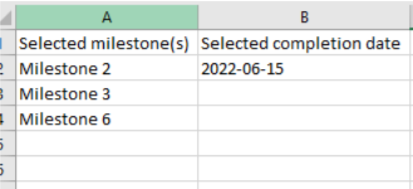

# Application Preview
https://user-images.githubusercontent.com/55518277/135971003-49934f9e-917e-4922-b48e-0ce10a113153.mp4

# Introduction
The project is built with Material UI + React.js frontend + Flask backend and deployed as a desktop application through Electron. The Milestone-App project is a milestone dashboard which accepts xlsx file input from users and generates default milestone/date options based on that. Users will be able to select one or more default milestones and then select only one of the completion dates associated with those selected milestones during the previous step or enter a custom date manually. Exporting dashboard data to xlsx file is also supported.

# Installation
1. create and activate a virtual environment (recommended but not required)
2. clone the project
3. install Flask `pip install flask`
4. `npm install` to install all dependencies
5. `npm start`

Note: please use `yarn add {your package name}` within the Milestone-Desktop-App-Update folder to add dependencies if there is any other dependency that is not installed by `npm install` 

# Documentation
### React.js ###
Filename | Component | Notes
------------- | ------------- | -------------
App.js | main component | Everything of this project is contained by this component. Parent component of AddMileston.js, AddDate.js, MyToolBar.js and MilestoneTableHead.js. Responsive Design. Rows per page is 5 and rows can be selected for deletion.
AddMileston.js | add milestone button | Milestone options are imported through user-input xlsx files. Only imported milestone options are provided.
AddDate.js | add date button | Date options are imported through user-input xlsx files. Only imported milestone options are provided. Only date options that are associated with those previously selected milestones are shown. Customized date option is also supported. Once the date is selected, the date will apply to all the pending milestones (the milestones that don't have a date with them).
MyToolBar.js | header of the table | Import, export and delete buttons are provided. The delete button will be blocked if no row is selected. Success message/Error message are shown on successfully/failed exporting. No message for importing. If the importing action is failed, the milestone and the date options will be shown as "no data''. Only xlsx format is supported for importing and exporting. And the data format for the importing file is shown below. Any other format may cause errors and it's not able to be handled by the program yet.
MilestoneTableHead.js | column name of the table | column names are `Milestones` and `Dates`. Select-all checkbox is provided for easily selecting all rows on the table (including the ones that are on other pages)

### Flask ###
There are two routes in the Flask app (`app.py`): `@app.route('/getData', methods = ['GET'])` for importing and `@app.route('/PostData', methods = ['POST'])` for exporting. Potential errors are handled through try/except.

### Electron ###
The size of the Electron app (`main.js`) is responsive and calculated based on the size of the current monitor. And the URL of the Electron app is connected to the address of the React app.

